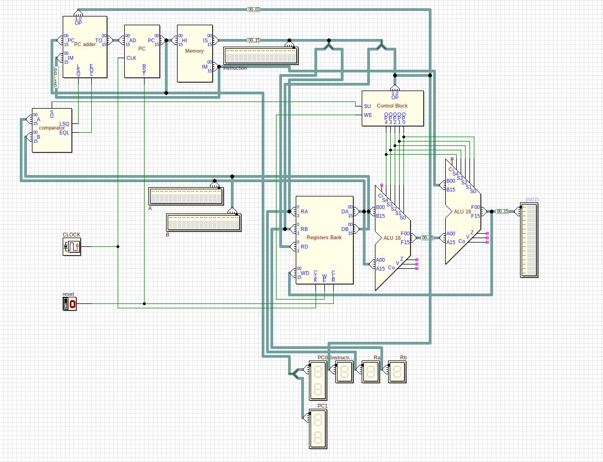

# The Zepto

The zepto processor is a small 16 bit educational processor that is implemented
using Deeds software. The image below shows an overview of the implemented
processor. If you want to see the circuitry for an specific component, open the
respective `.cbe` block file.

<p align="center">
    
</p>

# Circuitry

The circuits of the processor can be open using the Deeds DcS (Digital Circuit
Simulator). If you want to execute a specific program you will have to modify
the ROM (the memory.cbe block) input data in order to have the right program
loaded.

# The assembly language

Zepto is powered by a small assembly language. All available opcodes are listed
in the table below with the respective opcodes encoded in hexadecimal.

| opcode | Description                  | Opcode |
| ------ | ---------------------------  | ------ |
| addi   | Add with immediate           | '0000' |
| subi   | Subtract with immediate      | '0001' |
| andi   | And bitwise with immediate   | '0002' |
| ori    | Or bitwise with immediate    | '0003' |
| xori   | Xor bitwise with immediate   | '0004' |
| beq    | Conditional jump             | '0005' |
| bleu   | Conditional jump (Unsigned)  | '0006' |
| bles   | Unconditional jump (Signed)  | '0007' |

There's a collection of programs inside the `programs` folder. Zepto programs
(in its own assembly language) are sufixed with the `.z` extension, you can open
them in any text editor of your choice to read its content. Note that the linker
is in its **early stages** of development and it might not be fully compliant,
yet.

# Assembling

The assembler provides easy creation of compliant zepto programs with the Deeds
ROM specific format (.dsr). If you want to assemble some program all you have to
do is to execute the assembler with Python (>= 3.6) as shown below.

```
python3 assembler.py ./programs/sum.z
```

After the execution you will be able to the see the generated ROM files inside
the programs folter with the right format (`sum.drs` and `sum_immediate.drs`).


